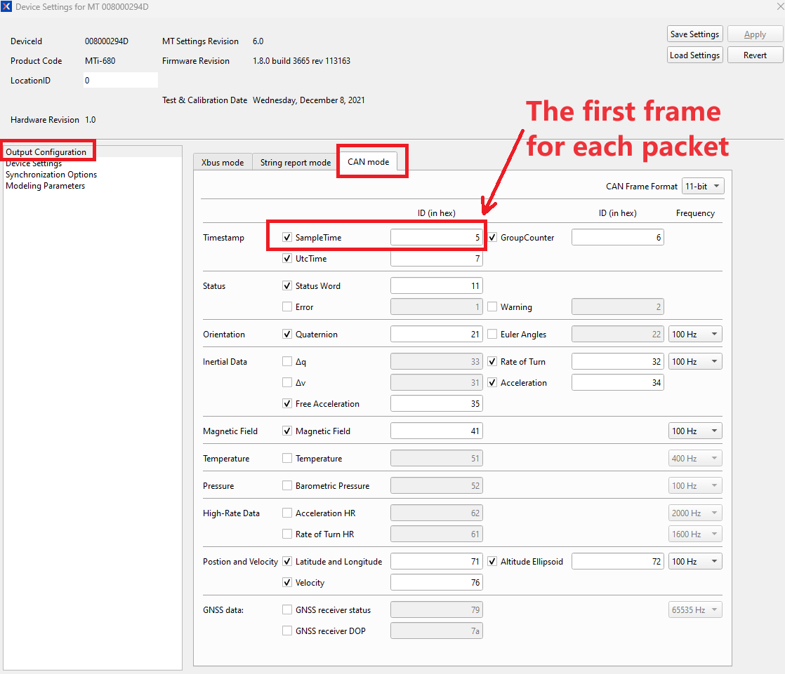
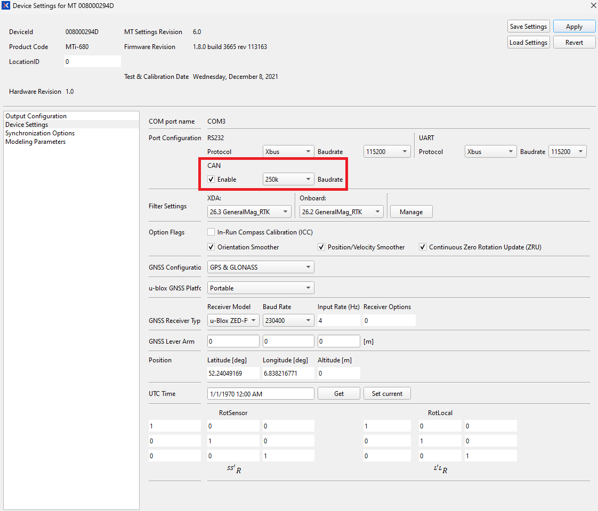

# Xsens MTi CAN ROS Driver

This code was based on the official ``xsens_ros_mti_driver`` and tested on MTi-680-DK on ubuntu 20.04LTS with ROS Noetic.
#### Note: the SampleTime, UTC Time needs to be enabled, in order to get the correct sequence of the data packet(To group multiple data types(CAN Frames) into one packet): MT Manager - Device Settings - Output Configuration - CAN mode , select "SampleTime, UTC Time" and other required data, click "Apply"

Here are the recommended Output Configurations and Device Settings:






## How to Install:
clone the source file to your ``catkin_ws``, and run the code below:
```
cd ~/catkin_ws
catkin_make
```
You might need to do ``catkin_make`` two times if you had deleted the ``devel`` and `build` folders, because you will see errors with the custom message `XsStatusWord`

Source the ``/devel/setup.bash`` file inside your catkin workspace
```
source ./devel/setup.bash
```
or 

add it into rules:
```
sudo nano ~/.bashrc
```
At the end of the file, add the following line:
```
source /[PATH_TO_Your_catkin_ws]/devel/setup.bash
```
save the file, exit.

## How to Use:
open terminal:
firstly configure the ``can0`` baudrate using the ``setup_can0.sh``:
```
sudo ./setup_can0.sh
```
Then:
```
roslaunch xsens_mti_can_ros_driver xsens_mti_can_node.launch
```
or with the 3D display rviz:
```
roslaunch xsens_mti_can_ros_driver display.launch
```

## Troubleshooting
use the below command in terminal to check if there is data:
```
candump -ta can0
```


## ROS Topics

| topic                    | Message Type                    | Message Contents                                                                                                                              | Data Output Rate<br>(Depending on Model and OutputConfigurations at MT Manager) |
| ------------------------ | ------------------------------- | --------------------------------------------------------------------------------------------------------------------------------------------- | ------------------------------------------------------------------------------- |
| filter/free_acceleration | geometry_msgs/Vector3Stamped    | free acceleration from filter, which is the acceleration in the local earth coordinate system (L) from which<br>the local gravity is deducted | 1-400Hz(MTi-600 and MTi-100 series), 1-100Hz(MTi-1 series)                      |
| filter/positionlla       | geometry_msgs/Vector3Stamped    | filtered position output in latitude (x), longitude (y) and altitude (z) as Vector3, in WGS84 datum                                           | 1-400Hz(MTi-600 and MTi-100 series), 1-100Hz(MTi-1 series)                      |
| filter/quaternion        | geometry_msgs/QuaternionStamped | quaternion from filter                                                                                                                        | 1-400Hz(MTi-600 and MTi-100 series), 1-100Hz(MTi-1 series)                      |
| filter/twist             | geometry_msgs/TwistStamped      | velocity and angular velocity                                                                                                                 | 1-400Hz(MTi-600 and MTi-100 series), 1-100Hz(MTi-1 series)                      |
| filter/velocity          | geometry_msgs/Vector3Stamped    | filtered velocity output as Vector3                                                                                                           | 1-400Hz(MTi-600 and MTi-100 series), 1-100Hz(MTi-1 series)                      |
| gnss_pose                | geometry_msgs/PoseStamped       | filtered position output in latitude (x), longitude (y) and altitude (z) as Vector3 in WGS84 datum, and quaternion from filter                | 1-400Hz(MTi-600 and MTi-100 series), 1-100Hz(MTi-1 series)                      |
| imu/acceleration         | geometry_msgs/Vector3Stamped    | calibrated acceleration                                                                                                                       | 1-400Hz(MTi-600 and MTi-100 series), 1-100Hz(MTi-1 series)                      |
| imu/angular_velocity     | geometry_msgs/Vector3Stamped    | calibrated angular velocity                                                                                                                   | 1-400Hz(MTi-600 and MTi-100 series), 1-100Hz(MTi-1 series)                      |
| imu/data                 | sensor_msgs/Imu                 | quaternion, calibrated angular velocity and acceleration                                                                                      | 1-400Hz(MTi-600 and MTi-100 series), 1-100Hz(MTi-1 series)                      |
| imu/dq                   | geometry_msgs/QuaternionStamped | integrated angular velocity from sensor (in quaternion representation)                                                                        | 1-400Hz(MTi-600 and MTi-100 series), 1-100Hz(MTi-1 series)                      |
| imu/dv                   | geometry_msgs/Vector3Stamped    | integrated acceleration from sensor                                                                                                           | 1-400Hz(MTi-600 and MTi-100 series), 1-100Hz(MTi-1 series)                      |
| imu/mag                  | geometry_msgs/Vector3Stamped    | calibrated magnetic field                                                                                                                     | 1-100Hz                                                                         |
| imu/time_ref             | sensor_msgs/TimeReference       | SampleTimeFine timestamp from device                                                                                                          | depending on packet                                                             |
| imu/utctime              | sensor_msgs/TimeReference       | UTC Time from the device                                                                                                                      | depending on packet                                                             |
| pressure                 | sensor_msgs/FluidPressure       | barometric pressure from device                                                                                                               | 1-100Hz                                                                         |
| status                   | diagnostic_msgs/DiagnosticArray | statusWord, 32bit                                                                                                                             | depending on packet                                                             |
| temperature              | sensor_msgs/Temperature         | temperature from device                                                                                                                       | 1-400Hz(MTi-600 and MTi-100 series), 1-100Hz(MTi-1 series)                      |
| tf                       | geometry_msgs/TransformStamped  | transformed orientation                                                                                                                       | 1-400Hz(MTi-600 and MTi-100 series), 1-100Hz(MTi-1 series)                      |

Please refer to [MTi Family Reference Manual](https://mtidocs.xsens.com/mti-system-overview) for detailed definition of data. 